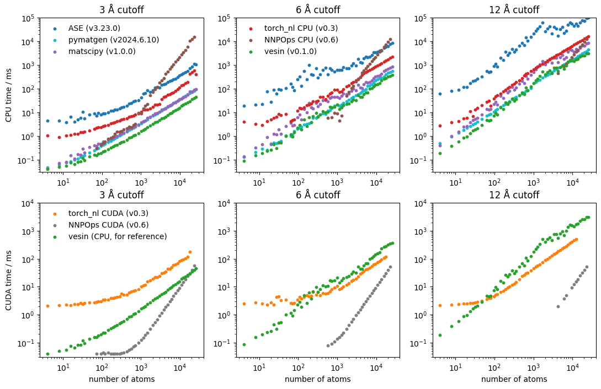

# Vesin: fast neighbor lists for atomistic systems

[](http://luthaf.fr/vesin/)


| US English 🇺🇸 | UK English 🇬🇧 | Occitan  | French 🇫🇷 | Gallo‑Italic  | Catalan  | Spanish 🇪🇸 | Italian 🇮🇹 |
|---------------|---------------|----------|-----------|--------------|---------|------------|------------|
| neighbor      | neighbour     | vesin    | voisin    | visin        | veí     | vecino     | vicino     |


Vesin is a C library that computes neighbor lists for atomistic system, and tries
to be fast and easy to use. We also provide a Python package to call the C
library.

### Installation

To use the code from Python, you can install it with `pip`:

```
pip install vesin
```

See the [documentation](https://luthaf.fr/vesin/latest/index.html#installation)
for more information on how to install the code to use it from C or C++.

### Usage instruction

You can either use the `NeighborList` calculator class:

```py
import numpy as np
from vesin import NeighborList

# positions can be anything compatible with numpy's ndarray
positions = [
    (0, 0, 0),
    (0, 1.3, 1.3),
]
box = 3.2 * np.eye(3)

calculator = NeighborList(cutoff=4.2, full_list=True)
i, j, S, d = calculator.compute(
    points=points,
    box=box,
    periodic=True,
    quantities="ijSd"
)
```

We also provide a function with drop-in compatibility to ASE's neighbor list:

```py
import ase
from vesin import ase_neighbor_list

atoms = ase.Atoms(...)

i, j, S, d = ase_neighbor_list("ijSd", atoms, cutoff=4.2)
```

See the [documentation](https://luthaf.fr/vesin/latest/c-api.html) for more
information on how to use the code from C or C++.

### Benchmarks

You can find below benchmark result computing neighbor lists for increasingly
large diamond supercells, using an AMD 3955WX CPU and an NVIDIA 4070 Ti SUPER
GPU. You can run this benchmark on your system with the script at
`benchmarks/benchmark.py`. Missing points indicate that a specific code could
not run the calculation (for example, NNPOps requires the cell to be twice the
cutoff in size, and can't run with large cutoffs and small cells).



## License

Vesin is is distributed under the [3 clauses BSD license](LICENSE). By
contributing to this code, you agree to distribute your contributions under the
same license.
